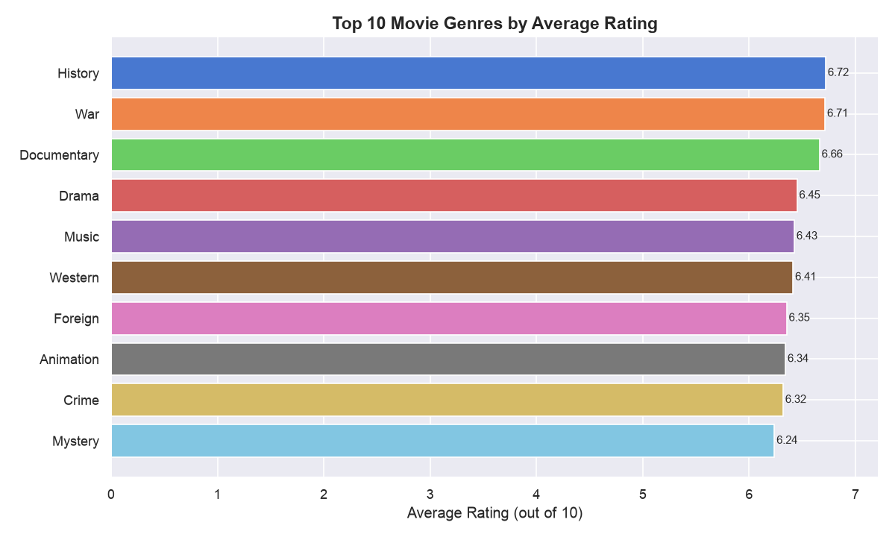
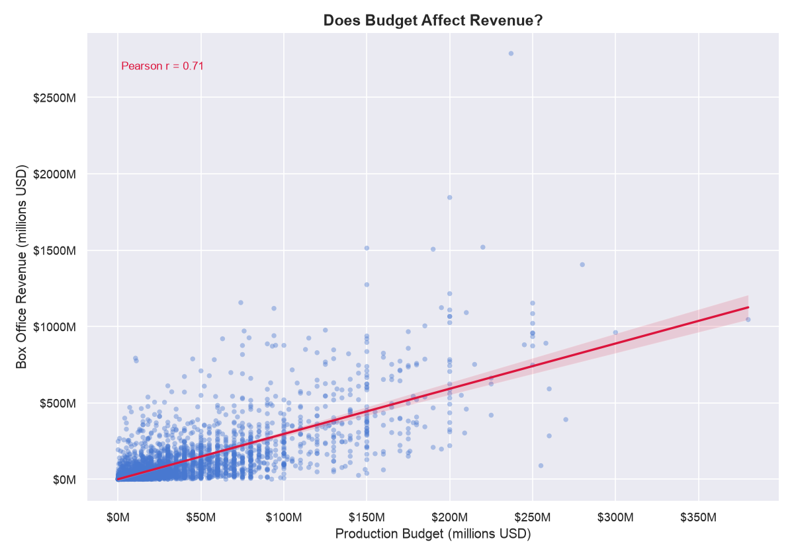
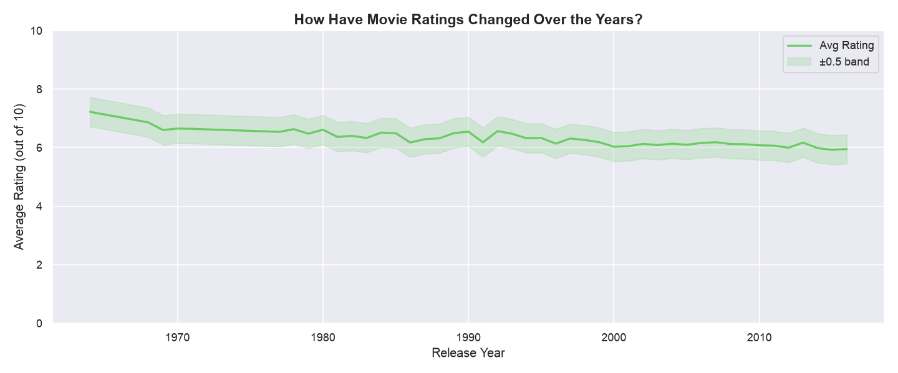
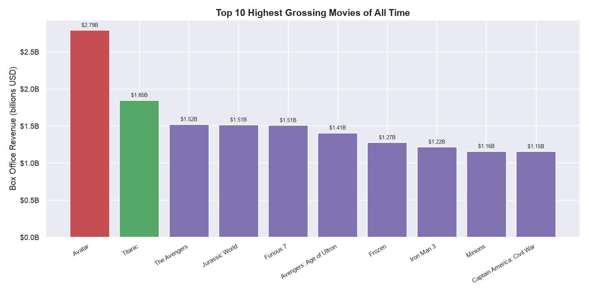

# Movie Data Explorer

A data analysis project exploring trends, ratings, and box office performance using the TMDB 5000 Movies dataset.

---

## About the Project

This project analyzes real-world movie data to uncover patterns in genre ratings, budget-to-revenue relationships, historical rating trends, and box office performance. The goal is to answer questions like: *Which genres are rated highest? Does a bigger budget mean more revenue? Have movie ratings changed over time?*

---

## Dataset

**TMDB 5000 Movie Dataset** — sourced from [Kaggle](https://www.kaggle.com/datasets/tmdb/tmdb-movie-metadata)

- ~5,000 movies with metadata including genres, budgets, revenues, ratings, and release dates
- Covers movies from the early 1900s through 2017

---

## Analysis & Key Insights

### 1. Top Genres by Average Rating
Analyzed average audience ratings across all major genres.

**Finding:** History is the highest-rated genre with an average score of **6.72/10**, outperforming Action, Comedy, and Drama.



---

### 2. Budget vs. Revenue Correlation
Examined the relationship between a movie's production budget and its box office revenue.

**Finding:** Budget and revenue have a strong positive correlation of **0.71**, meaning higher-budget films tend to earn significantly more at the box office.



---

### 3. Movie Ratings Over Time
Tracked how average audience ratings have shifted across decades.

**Finding:** Average ratings have declined over time — from **6.83** (pre-1970) down to **6.02** (post-2010), suggesting either increasing audience expectations or shifting rating behavior.



---

### 4. Top 10 Highest-Grossing Movies
Ranked movies by total worldwide box office revenue.

**Finding:** *Avatar* (2009) is the highest-grossing movie in the dataset at **$2.79 billion**, followed by other major blockbusters.



---

## Technologies Used

| Tool | Purpose |
|------|---------|
| Python | Core programming language |
| Pandas | Data loading, cleaning, and analysis |
| Matplotlib | Base charting and plot customization |
| Seaborn | Statistical visualizations |
| Jupyter Notebook | Interactive exploration |

---

## How to Run

**1. Clone the repository**
```bash
git clone https://github.com/your-username/movie-data-explorer.git
cd movie-data-explorer
```

**2. Install dependencies**
```bash
pip install -r requirements.txt
```

**3. Run the analysis script**
```bash
python analysis.py
```

Charts will be saved to the `charts/` folder.

**Or explore interactively in Jupyter:**
```bash
jupyter notebook notebooks/
```

---

## Project Structure

```
movie-data-explorer/
├── data/               # Raw dataset files
├── charts/             # Generated visualizations
├── notebooks/          # Jupyter notebooks for exploration
├── analysis.py         # Main analysis script
├── requirements.txt    # Python dependencies
└── README.md
```
